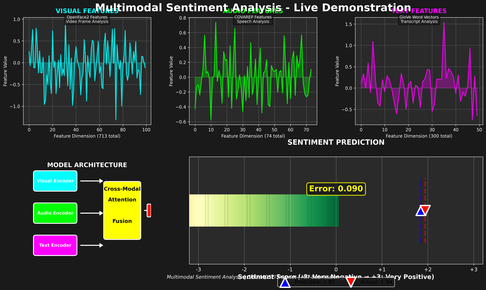

# 🎬 Demo Video Guide

This guide helps you create a demonstration video for your MIT Slideroom submission using a real CMU-MOSI sample.

## Quick Demo Options

### Option 1: Interactive HTML Demo (Easiest)
1. **Open `demo.html` in your browser**
   - Double-click `demo.html` or open it in Chrome/Firefox
   - Shows a nice interactive visualization
   - Perfect for screenshots or screen recording

### Option 2: Generate Demo Frame
```bash
python create_demo_video.py
```
This creates:
- `demo_video_frame.png` - Professional visualization frame
- `demo.html` - Interactive demo page

### Option 3: Run Live Demo with CMU-MOSI
```bash
python demo_single_sample.py
```
This will:
- Load a sample from CMU-MOSI dataset
- Extract features from video, audio, transcript
- Run inference and show prediction
- Generate visualization images

## Creating Your Demo Video

### Step 1: Prepare
1. Run `python demo_single_sample.py` with your CMU-MOSI dataset
2. Note which video file was used
3. Have the generated `demo_simple.png` ready

### Step 2: Record
Use screen recording software (OBS, Camtasia, Windows Game Bar):
1. **Show the input video** (left side of screen)
2. **Show the transcript** (middle)
3. **Show the prediction result** (right side - use `demo_simple.png`)
4. **Explain the process** as you record

### Step 3: Edit
- Keep it 2-3 minutes
- Add titles/intro
- Highlight key features
- Show the final prediction clearly

## Demo Script Template

**Introduction (0:00-0:15)**
> "This is a demonstration of our multimodal sentiment analysis system. The model combines visual, audio, and text features to predict sentiment scores."

**Architecture Overview (0:15-0:45)**
> "The system processes three modalities:
> - Visual features extracted from video frames
> - Audio features from speech signals  
> - Text features from transcripts
> 
> These are encoded and fused using cross-modal attention."

**Live Demo (0:45-1:30)**
> "Here we see a sample from the CMU-MOSI dataset. The model extracts 713-dimensional visual features, 74-dimensional audio features, and 300-dimensional text features. These are combined through our architecture to produce a sentiment prediction."

**Results (1:30-2:00)**
> "The model predicted a sentiment score of [X.XX], indicating [sentiment label]. This demonstrates how our multimodal approach effectively combines different information sources."

## Files for Your Video

- **`demo.html`** - Interactive demo (open in browser)
- **`demo_video_frame.png`** - Reference visualization
- **`demo_simple.png`** - Generated from demo script (clean view)
- **`demo_visualization.png`** - Detailed technical view

## Tips

- Use `demo.html` for a quick, clickable demo
- Use `demo_simple.png` for clean presentation
- Show actual video playing if possible
- Highlight the multimodal nature
- Keep it concise and clear

## Embedding in GitHub

GitHub automatically renders:
- ✅ `demo.html` - Can be viewed directly on GitHub
- ✅ `demo_video_frame.png` - Shows in README
- ✅ `demo_simple.png` - Shows in README

To add to README, use:
```markdown
## 🎬 Demo



[View Interactive Demo](demo.html)
```

